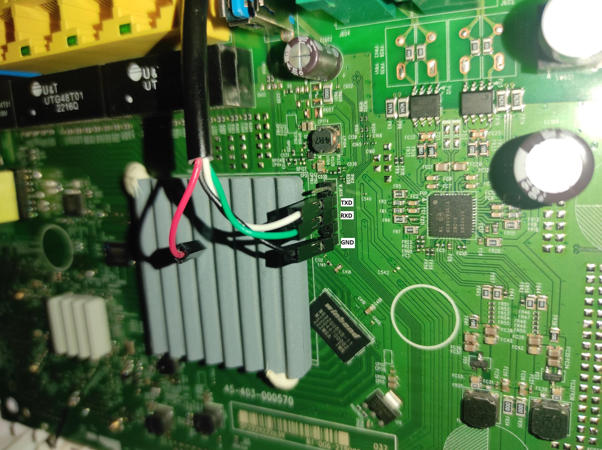

# Zyxel VMG8623-T50B DE branding
> A guide to debrand (remove ISP firmware & locked bootloader) the Zyxel VMG8623-T50B router

## Tools required 
- USB-TTL 
- A Linux laptop with Minicom & a hex editor (okteta for example)
- A usb flash drive formatted with a msdos (MBR) partition table & Fat32


# Pre-Requisites 

1. Obtain the root password for your device 

Use the password generator in the ZyxelRoot.py file (Execute it online [Here](https://www.onlinegdb.com/XR_spa_we)) to generate the device's root password for the zycli shell, accessible from both SSH & serial TTL. 

2. Open up the device, connect the usb-TTL to the serial headers on the device 

This operation could be done from ssh but using the serial header you can have a better picture of the state of the device since it outputs bootloader & other debug messages. 

The device has pre-soldered headers. 



Don’t forget to connect the router's TxD -> USB-TTL RxD & USB-TTL TxD to router's RxD!

3. obtain shell access 

 Once the device finishes bootup, you should be greeted by "press enter to enable shell " or similar message, Press return to open the prompt to type the username (`root`) and the root password you generated on the prep step. 


The stock device reports `zycli sys atsh` as following: 

```
Firmware Version        : V[version in the x.xx format](A[branch].[some revision])[higher level revision]
Bootbase Version        : V[version] | [date{
Vendor Name             : Zyxel Communications Corp.
Product Model           : VMG8623-T50B
Serial Number           : S220Y10021864
First MAC Address       : macadress
Last MAC Address        : macadress+0xf
MAC Address Quantity    : 16
Default Country Code    : (country code)
Boot Module Debug Flag  : 01
Kernel Checksum         : 68A00776
RootFS Checksum         : EB4B7592
Romfile Checksum        : 00000F7B
Main Feature Bits       : 00
Other Feature Bits      :
7f9ca5d2: 04050f0d 00000100 00000000 00000000
7f9ca5e2: 00000000 00000000 00000000
```

On [this](https://github.com/AgostinoA/OpenWrt-ZyXEL-VMG8825-T50/blob/main/stock/V5.50(ABOM.3)C0/docs_zyxel/Zyxel_Model_ID_and_Firmware_version.xlsx) xlsx file from the OpenWrt-ZyXEL-VMG8825-T50 project we see that there is a Model with an ID that corresponds to 0x45FD

|Model ID|	Project|	Notes |
|-|-|-|
|0x45FD|	VMG8623-T50B WindGreece|	EN7516+256MB RAM|

This happens to have very similar specs (SoC & ram capacity) with the _VMG8623-T50B Generic_ whose model ID is `0x4553`, shared with `EMG5523-T50A Generic`.

While Investigating the firmware available on [zyxel's website](https://www.zyxel.com/global/en/support/download?model=vmg3625-t50b) we find out that `04 05 05 03` with a hex encoding is found in what looks to be a file header on the ABPM branch.
therefore, changing the ModelID is likely possible. Lets do it then 


# Step 1 (Unlocking the bootloader)

1. Backup the bootloader

Locate the bootloader: 

Running `cat /proc/mtd` will output: 
``` 
mtd0: 00040000 00020000 "bootloader"
mtd1: 00040000 00020000 "romfile"
mtd2: 00204753 00020000 "kernel"
mtd3: 01940004 00020000 "rootfs"
mtd4: 02800000 00020000 "tclinux"
mtd5: 001fdc0c 00020000 "kernel_slave"
mtd6: 01780004 00020000 "rootfs_slave"
mtd7: 026a0000 00020000 "tclinux_slave"
mtd8: 00100000 00020000 "wwan"
mtd9: 00400000 00020000 "data"
mtd10: 00100000 00020000 "rom-d"
mtd11: 02000000 00020000 "misc"
mtd12: 000c0000 00020000 "reservearea"
```
And this will show us that `mtd0` is the bootloader that we want to extract. 

2. Dump The Bootloader 

Connect the flash drive to the device and type 

```
cd /mnt/usbX_sdYZ
```
X , Y , Z are place holders cause different devices can change where they are mounted. For example, I got `usb2_sda1`

Now that we are on the flash drive , we will extract the bootloader on the usb. This is so we won’t need SCP to transfer the bootloader back and forth.

```
dd if=/dev/mtd0 of=/mnt/usbX_sdYZ/bootloader.bin
```

This will have dumped the bootloader partition on the usbFlash. 
Grab the usb flash, plug it on the computer and open _bootloader.bin_ on okteta (the hex editor of my choice, feel free to use what you are comfortable with)

3. Patch the bootloader 

Edit the byte sequence : `04 05 0F 0D` at offset `0000FFC0` (on my bootloader , yours might be different) To `04 05 05 03`,

save it on the flash drive as _patchedBootloader.bin_ safe remove the usb flash and connect the flash drive back to the device

connect the flash drive back to the router, Keep in mind that there is a chance that the path changed.For example in mine initaly was mounted on  `/mnt/usb2_sda1` but then was changed to `/mnt/usb2_sdb1` !

once in the directory with the patched bootloader, type the command 

```
mtd unlock && mtd writeflash patchedBootloader.bin 262144 0 bootloader && zycli sys atcd && reboot
```

followed with a device rtfd (reset to factory defaults)

```
zycli sys atcr reboot
```

# Step 2  (Flashing Stock Firmware)

After a reboot we see that we can update the firmware using [Zyxel's official downloads](https://www.zyxel.com/global/en/support/download?model=vmg3625-t50b)

After flashing the firmware the device will change IP from `192.168.1.254` to `192.168.1.1` , you can login as a souperadmin with the password written in the label 

Now you own a device that can , from now on ,be updated using the web Ui and is basically indistinguishable in all terms other than the Serial Number from a Generic Device.
